# :desktop_computer: Serverteknologi-HF2

Af Mark, Jacob & Mads

## Indhold:
* [Del-1](#del-1)
	* [VMWare](#vmware)
	* [IP Table](#ip-table)
	* [Server opsætning](#server-opsætning)
* [Del-2](#del-2)
* [Del-3](#del-3)
	* [Underpunkt-1](#)
* [Del-4](#del-4)
* [Del-5](#del-5)
* [Del-6](#)
* [Del-7](#)
* [Del-8](#)
* [Del-9](#)
* [Del-10](#)
* [Del-11](#)
	* [Underpunkt-1](#)
	* [Underpunkt-2](#)

<!-------------------------------------------------------------------- DEL-1 ---------------------------------------------------------------------------------------->
## Del-1
### VMWare
Opretter et extra netkort på Server1 og sætter det til Custom (VMnet4).
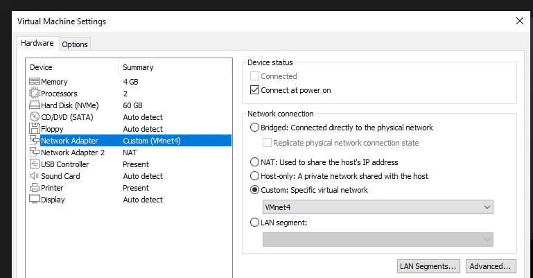
 
Tilføjer en extra harddisk på Server1.
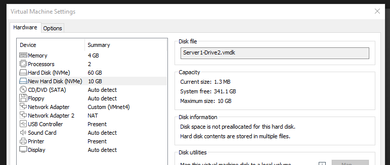
 
### IP Table
| Navn          | IP adresse    | DNS          | Gateway      | Subnet       |
| ------------- |:-------------:|:-------------|:-------------|:-------------:
| Server1       | 192.168.10.1  | 127.0.0.1    | 127.0.0.1    | 255.255.255.0|
| Server2       | 192.168.10.2  | 192.168.10.1 | 192.168.10.1 | 255.255.255.0|
| Server3       | 192.168.10.3  | 192.168.10.1 | 192.168.10.1 | 255.255.255.0|
| Client1       | DHCP          | 192.168.10.1 | 192.168.10.1 | 255.255.255.0|
### Server opsætning
Omdøber server nummer 3, til Server3. (Det gør vi for alle 3 servere inden vi går videre med opsætningen).
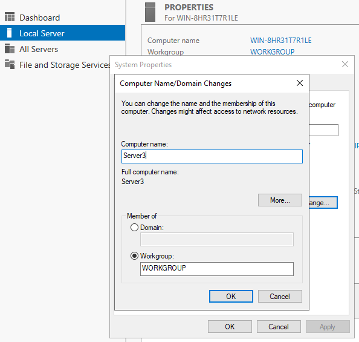
 
Vælger server roller på Server1. ADDS, DHCP og DNS.
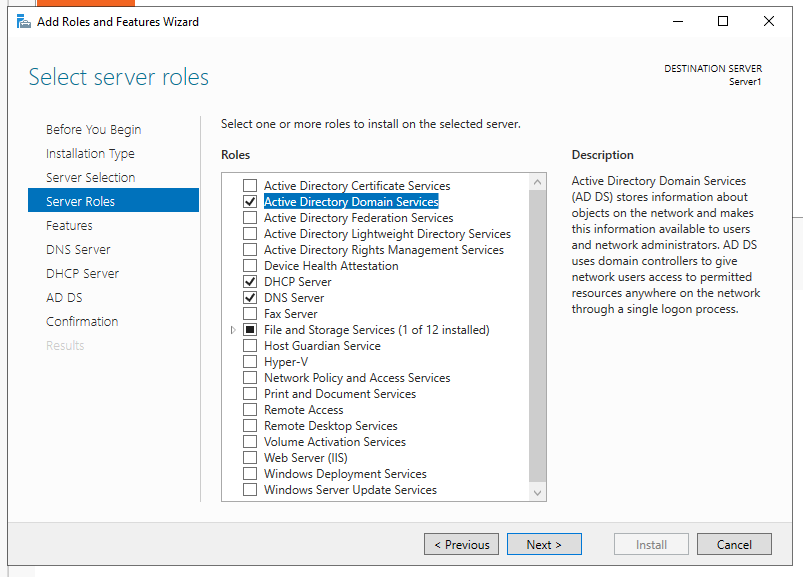
 
Sætter statisk IP på Server2 og Server3.
 
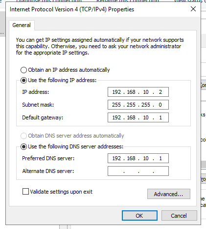
 
Tilføjer Server2 og Server3 til domænet jmm.local.
 
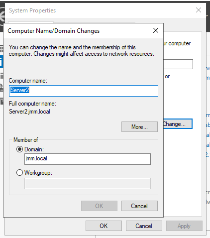
 
Resultat.
 
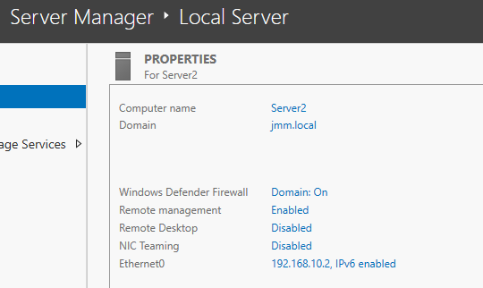
<!-------------------------------------------------------------------- DEL-2 ---------------------------------------------------------------------------------------->
## Del-2
Opsætning af DNS Forward Lookup Zone (FLZ) og Reverse Lookup Zone (RLZ) for vores domæne.
 
 
Installerer DNS på Server2.
 
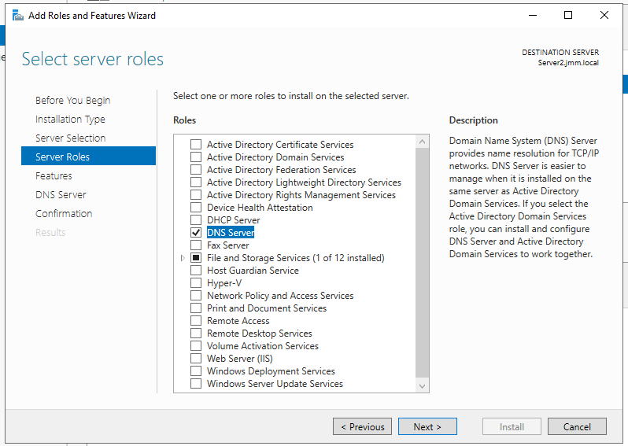
 
<!-------------------------------------------------------------------- DEL-3 ---------------------------------------------------------------------------------------->
## Del-3
Opsætning af DHCP.
 
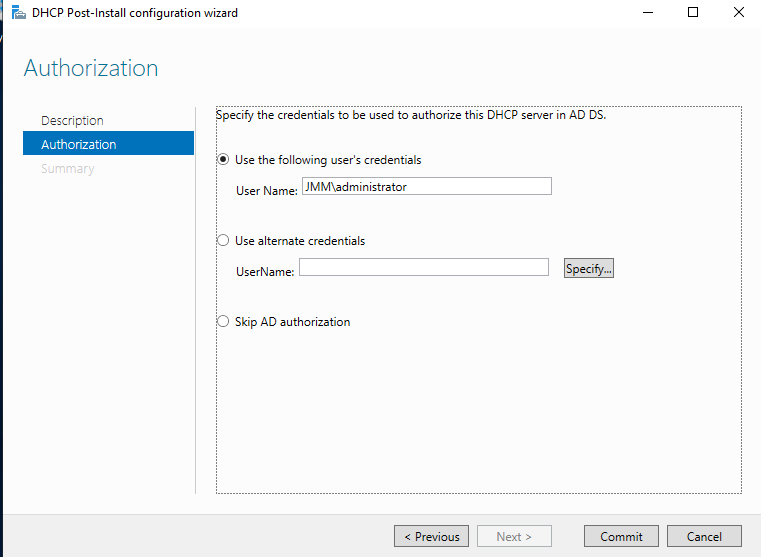
 
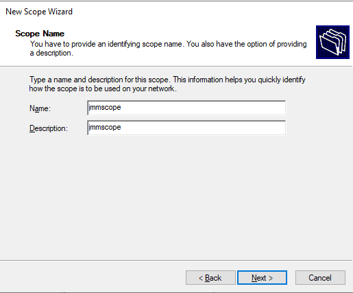
 
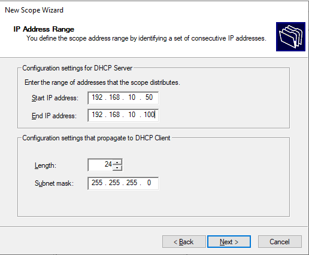
 
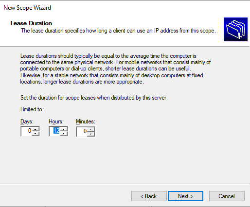
 
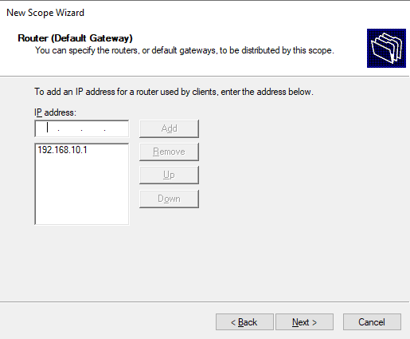
 
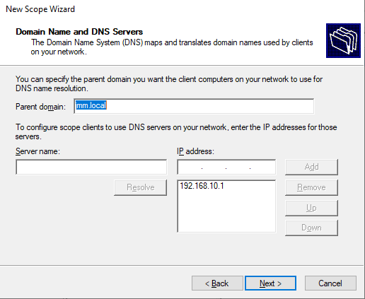
 
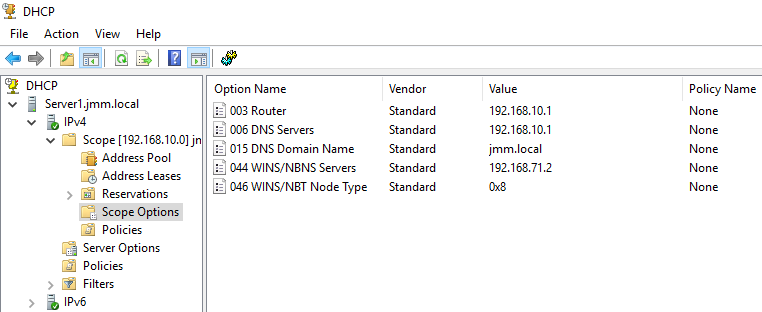
 
Tilføjer vores klient til domænet jmm.local.
 
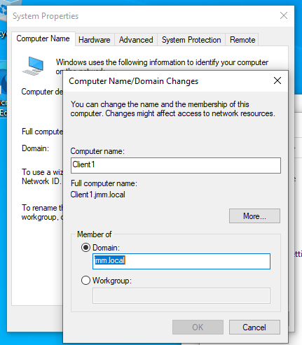
 
DHCP virker på Client1.
 
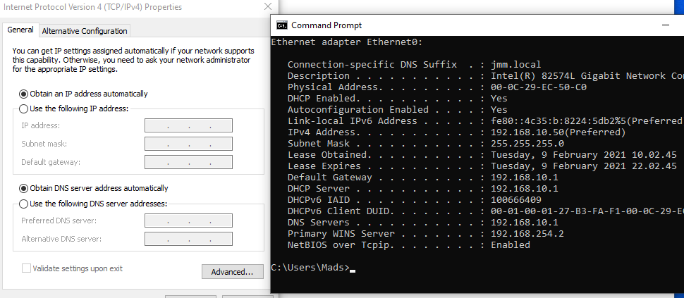
 
Vi har ikke brug for at konfigurere en IpHelper (DHCP Relay agent) da alle enheder er på samme fysiske subnet.
 
 
DHCP options 003, 006 og 015 konfigureres på DHCP serveren:
003 Router: Angiver en liste over Ip-adresser over alle routere på samme subnet som DHCP klienterne. 
Klienterne kender nu alle de routere der er tilgængelige på nettet så de kan kontaktes efter behov hvis der skal sendes IP pakker til hosts på andre netværk.
 
 
006 DNS Servers: Ip-adressen på de DNS servere, på subnettet, som DHCP klienter kan kontakte hvis de skal have fat i en IP-adresse via domænenavnet eller omvendt.
 
 
015 DNS Domain Name: Angiver det domæne navn som DHCP klienter skal anvende hvis de skal resolve et ukvalificeret domæne navn. 
Denne indstillinger tillader også at DHCP klienter kan lave dynamiske DNS opdateringer.
 
<!-------------------------------------------------------------------- DEL-4 ---------------------------------------------------------------------------------------->
## Del-4
For at kunne ping og ftp til Server2 har vi deaktiveret firewall.
 

 
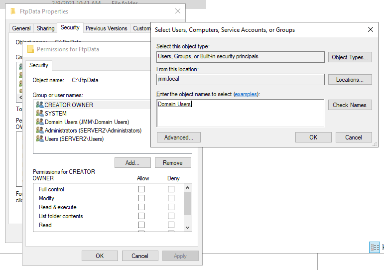
 
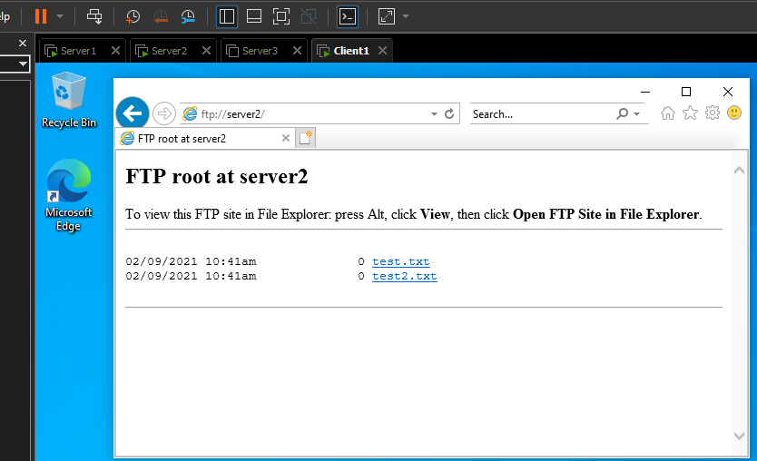
<!-------------------------------------------------------------------- DEL-5 ---------------------------------------------------------------------------------------->
## Del-5
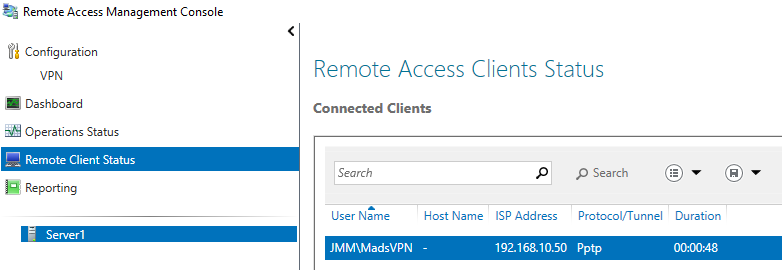
 