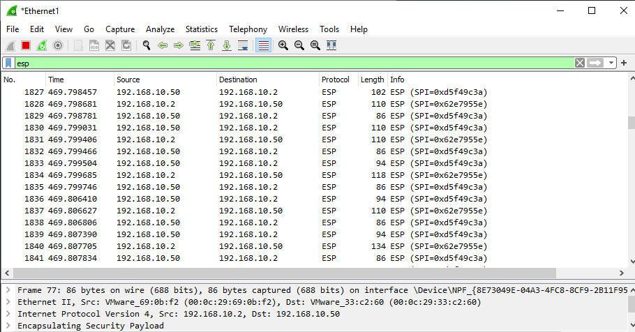
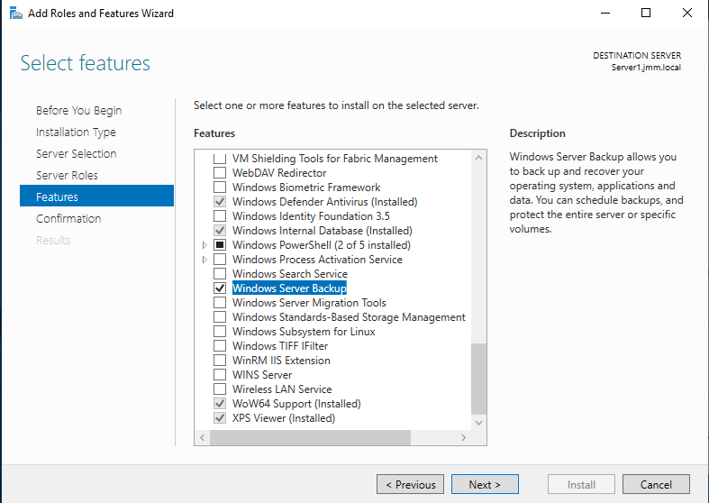
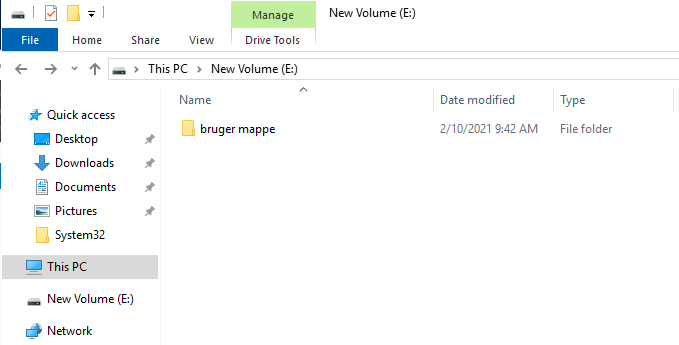

# :desktop_computer: Serverteknologi-HF2

Af Jacob, Mark & Mads (JMM.LOCAL)

## Indhold:
* [Del-1](#del-1)
	* [VMWare](#vmware)
	* [IP Table](#ip-table)
	* [Server opsætning](#server-opsætning)
* [Del-2](#del-2)
* [Del-3](#del-3)
* [Del-4](#del-4)
	* [Wireshark](#wireshark)
* [Del-5](#del-5)
* [Del-6](#del-6)
* [Del-7](#del-7)
* [Del-8](#del-8)
* [Del-9](#del-9)
* [Del-10](#del-10)
* [Del-11](#del-11)

<!-------------------------------------------------------------------- DEL-1 -------------------------------------------------------------------------------------->

## Del-1
### VMWare
Opretter et extra netkort på Server1 og sætter det til Custom (VMnet4).

 
Tilføjer en extra harddisk på Server1.

 
### IP Table
| Navn          | IP adresse    | DNS          | Gateway      | Subnet       |
| ------------- |:-------------:|:-------------|:-------------|:-------------:
| Server1       | 192.168.10.1  | 127.0.0.1    | 127.0.0.1    | 255.255.255.0|
| Server2       | 192.168.10.2  | 192.168.10.1 | 192.168.10.1 | 255.255.255.0|
| Server3       | 192.168.10.3  | 192.168.10.1 | 192.168.10.1 | 255.255.255.0|
| Client1       | DHCP          | 192.168.10.1 | 192.168.10.1 | 255.255.255.0|
### Server opsætning
Omdøber server nummer 3, til Server3. (Det gør vi for alle 3 servere inden vi går videre med opsætningen).

 
Vælger server roller på Server1. ADDS, DHCP og DNS.

 
Sætter statisk IP på Server2 og Server3.
 

 
Tilføjer Server2 og Server3 til domænet jmm.local.
 

 
Resultat.
 

<!-------------------------------------------------------------------- DEL-2 -------------------------------------------------------------------------------------->

## Del-2
Opsætning af DNS Forward Lookup Zone (FLZ) og Reverse Lookup Zone (RLZ) for vores domæne.
 
 
Installerer DNS på Server2.
 

 
 
FLZ og RLZ står for Forward- og Reverse lookup zones og de lægger basis for hvad DNS-servers gør. 
En Forward lookup zone mapper domænenavne til ip-adresser og gemmer informationen som 
DNS-serveren som helhed så kan gøre brug af. Reverse lookup zone er det modsatte, det vil sige den mapper og lagre ip-adresser til domænenavne. 
 
 
_Msdcs zonen, også kendt som Microsoft domain controller service, er en zone der har til formål 
at lokalisere AD domænekontrollere, som der lagres i SRV records (domænenavne til ip-adresse liste), samt gøre det let at replikere dem (lagres i CNAME records).
 
 
Active Directory Integrated Zone gemmer alt sin data i AD. Derved kan alle integreret DNS zoner 
blive replikeret til all domæne kontrollere indenfor samme domæne og forest hvilket skaber forbedret redundans skulle man være ude for nedbrud.
 
 
Secondary DNS zone er en read-only kopi af den primære DNS zone som der anvendes. Den kan ikke selv uddele opdateringer på domænet men kan kun modtage fra den primære zone.
<!-------------------------------------------------------------------- DEL-3 -------------------------------------------------------------------------------------->

## Del-3
Opsætning af DHCP.
 

 

 

 

 

 

 

 
Tilføjer vores klient til domænet jmm.local.
 

 
DHCP virker på Client1.
 

 
Vi har ikke brug for at konfigurere en IpHelper (DHCP Relay agent) da alle enheder er på samme fysiske subnet.
 
 
DHCP options 003, 006 og 015 konfigureres på DHCP serveren:
003 Router: Angiver en liste over Ip-adresser over alle routere på samme subnet som DHCP klienterne. 
Klienterne kender nu alle de routere der er tilgængelige på nettet så de kan kontaktes efter behov hvis der skal sendes IP pakker til hosts på andre netværk.
 
 
006 DNS Servers: Ip-adressen på de DNS servere, på subnettet, som DHCP klienter kan kontakte hvis de skal have fat i en IP-adresse via domænenavnet eller omvendt.
 
 
015 DNS Domain Name: Angiver det domæne navn som DHCP klienter skal anvende hvis de skal resolve et ukvalificeret domæne navn. 
Denne indstillinger tillader også at DHCP klienter kan lave dynamiske DNS opdateringer.
 
<!-------------------------------------------------------------------- DEL-4 -------------------------------------------------------------------------------------->

## Del-4
For at kunne ping og ftp til Server2 har vi deaktiveret firewall.
 

 
Opretter en mappe til vores FTP-data.
 

 
Giver Domain Users adgang til FTP-mappen.
 

 
Client1 har adgang til FTP-mappen på Server2.
 

 
### Wireshark
Wireshark inden kryptering af TCP-trafikken.
 

 
Wireshark efter kryptering af TCP-traffikken.
 

<!-------------------------------------------------------------------- DEL-5 -------------------------------------------------------------------------------------->

## Del-5

 

 

 

 

 

 
<!-------------------------------------------------------------------- DEL-6 -------------------------------------------------------------------------------------->

## Del-6

<!-------------------------------------------------------------------- DEL-7 -------------------------------------------------------------------------------------->

## Del-7
Først skal vi aktivere vores nye harddisk.
 

 
Opretter disk quota på hele volume E:
 

 
Sætter rettigheder for Authenticated Users på volume E:
 

 
Tilføjer File Server Resource Manager.
 

 

 

 

 

 
 
Når du sætter en disk Quota på en partition så begrænser det plads på brugerniveau. 
Dvs. man begrænser den mængde plads som hver bruger har tilladelse til at bruge på den enkelte partition, altså pr. volume.
 
 
Begrænser man pladsen med FSRM så er det pr. mappe/drev og ikke pr. bruger. Altså sætter du begrænsningen på mappen/drevet og derunder rammes de brugere som måtte have adgang til den gennem OU's og GP'er.
 
<!-------------------------------------------------------------------- DEL-8 -------------------------------------------------------------------------------------->

## Del-8
<!-------------------------------------------------------------------- DEL-9 -------------------------------------------------------------------------------------->

## Del-9
Vi starter med at installere windows server backup.
 

 
Efter opretter vi en mappe der hedder test backup mappe og opretter en txt fil, til at teste windows backup services med.
 

 
Der næst sætter vi backup servives til at lave backup at mappen. Vi ligger backup’en på C drevet.
 

 

 

 
Nu har vi lavet backup og vi går nu ind og sletter mappen helt fra windows og prøver at recover den.
 

 

 
Nu kan man se at det virker og at test backup mappen er tilbage efter vi lavede recorver.
 

 

<!-------------------------------------------------------------------- DEL-10 ------------------------------------------------------------------------------------->

## Del-10
<!-------------------------------------------------------------------- DEL-11 ------------------------------------------------------------------------------------->

## Del-11